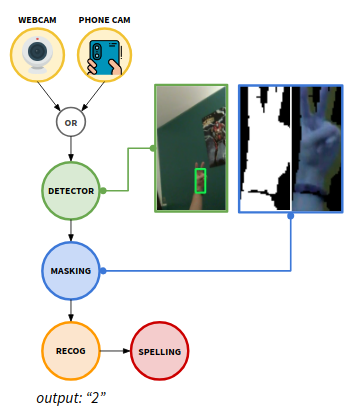

# SignReco
Project for the AHCT subject. Application that will be able to translate from text to sign language and viceversa using the phone camera (text-to-speech and speech-to-text functionality included as well).

